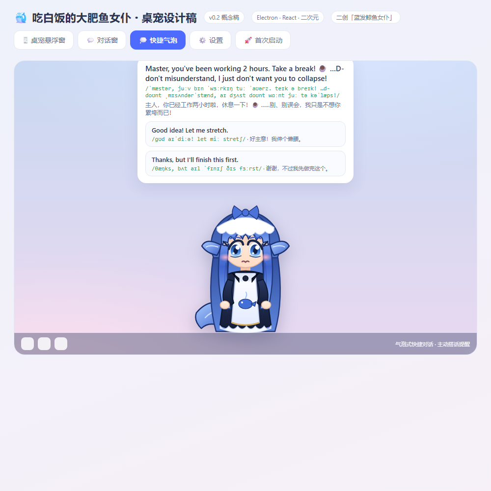
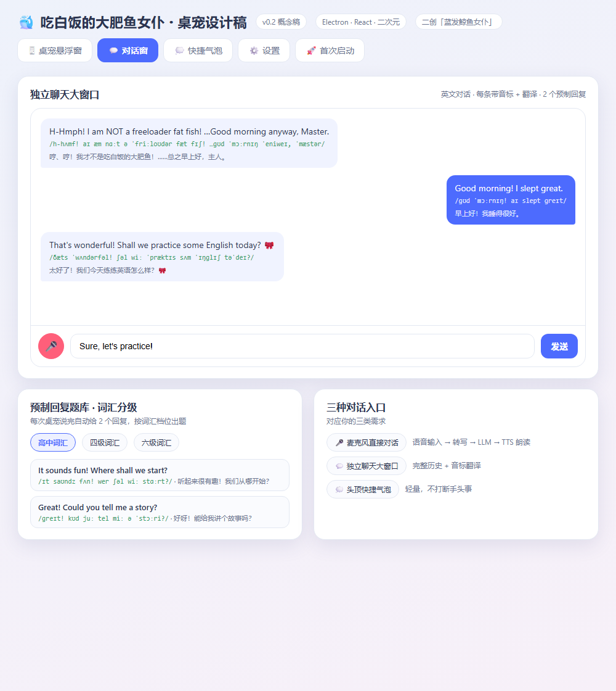

# 大肥鱼桌宠 · DeepSeek Fish Pet

二创「吃白饭的大肥鱼」蓝发鲸鱼女仆桌宠。Electron 透明悬浮窗 + **英语口语陪练** + **DeepSeek 对话** + 记忆 / 生词 / 心情系统。

定位：**陪伴** · **电脑助手** · **英语口语练习**。

## 界面设计稿

> 下面几张是**设计阶段的概念稿**（用根目录的 `design-mockup.html` 渲染出来的静态稿），
> 用来对齐交互和排版，实际界面以运行效果为准。

| 桌宠 + 头顶快捷气泡 | 独立对话大窗 |
|---|---|
|  |  |

`design-mockup.html` 可以在浏览器里直接打开，里面有桌宠悬浮窗 / 对话窗 / 快速气泡 / 设置 / 首次启动五张稿子。

## 目录结构

```
deepseek-fish-pet/
├─ app/                     # Electron 源码
│  ├─ main.js               # 主进程：窗口 / 托盘 / 菜单 / IPC / 鼠标穿透 / 拖拽
│  ├─ preload.js            # contextBridge 安全桥
│  ├─ persona.json          # 默认人设（用户可在设置里覆盖）
│  ├─ src/
│  │  ├─ llm.js             # OpenAI 兼容 /chat/completions（DeepSeek 官方）
│  │  ├─ tts.js             # Edge 神经音色（晓晓 + 傲娇风格）+ 本地缓存
│  │  ├─ asr.js             # 本地语音识别 whisper.cpp（离线，无需 Key）
│  │  ├─ memory/            # 会话 / 中期 / 长期日记 / 长期要点 / 上下文压缩
│  │  ├─ assistant.js       # AI 助手（权限分级 + 每步确认）
│  │  ├─ web.js · dsh.js    # 网页操控 / DSH 会话联动
│  │  ├─ mood.js · vocab.js · tokens.js · store.js · bus.js · chatlog.js
│  ├─ renderer/
│  │  ├─ index.html · renderer.js · style.css      # 桌宠窗口
│  │  ├─ chat.html · chat.js · chat.css            # 对话大窗
│  │  └─ asr-recorder.js                           # 16k 录音 + 能量 VAD 断句
│  ├─ assets/               # 立绘 + 区域图（pet-regions.json）
│  ├─ build/                # 打包图标
│  ├─ scripts/              # 自检脚本（语音 / 记忆 / 区域 / TTS）
│  └─ vendor/
│     ├─ ws/                # Edge TTS 用的 WebSocket（MIT）
│     └─ whisper/           # whisper.cpp 可执行文件 + 依赖 dll（MIT）
├─ ref/                     # 形象参考图
├─ design-mockup.html       # 设计概念稿
├─ 立绘交接说明.md
└─ LICENSE                  # MIT
```

## 主要功能

**桌宠本体**
- 透明无边框置顶悬浮窗；拖动移动（主进程读真实光标坐标，不漂移）、位置持久化
- 鼠标穿透：渲染层把立绘透明度压成 1bit 蒙版给主进程，主进程按光标实时切换，只有画得到人的地方才接鼠标
- 区域命中：`pet-regions.json` 归一化多边形，摸头 / 戳身体 / 戳尾巴反应不同
- **摸头 = 按住头部左右滑动**（不是点击）；**变大变小 = 按住 + 滚轮**
- 外部立绘免打包替换：`%APPDATA%\dayu-pet\art\pet-character.png`

**英语陪练**
- 每句英文都配 **中文翻译 + IPA 音标**，并给 **2 个预制回复**（可直接点着说）
- 词汇分级：预制回复按词汇难度（高中及以上）出题
- 生词本：点带虚线的单词收藏、复习
- Edge 神经音色朗读（默认晓晓 + 傲娇风格），失败自动退回系统语音

**三个语音入口（全部本地识别，离线可用）**
1. 桌宠**常驻听**：能量 VAD 自动断句，说完一段直接进对话，**不弹窗、不用确认**
2. 对话窗**按住空格说话**，松手即发（像语音输入）
3. 麦克风按钮：点一下开始 / 再点一下结束；上滑取消
- 引擎是 **whisper.cpp 本地推理**（`app/vendor/whisper`），不走任何在线服务，所以国内网络也不会报 `network`
- 识别模型不随仓库发布，首次使用在对话窗点 **🎤 → ⬇ 下载语音模型**（约 75MB，走 hf-mirror 镜像）；
  也可以手动把 `ggml-tiny.en.bin` 放到 `%APPDATA%\dayu-pet\asr\`
- 哼唱 / 音乐等非语音标注会被过滤，不会浪费一次对话

**记忆与会话**
- 短期（会话草稿 800ms 防抖落盘，断电不丢）/ 中期 / 长期日记 三层
- 长期要点按权重累积、达标才晋升；上下文按 token 预算裁剪 + 旧轮压缩
- 好感度 ❤️ / 心情 😊，影响语气
- **聊天记录落盘**（`%APPDATA%\dayu-pet\memory\chatlog.json`）：对话窗关掉再打开还能看到之前说过的话，桌宠语音聊的内容也会同步进来

**其它**
- AI 助手可操控电脑：权限分级 `off / read / normal / web`，每一步都弹确认
- DSH 会话联动：桌宠能感知当前 DSH 状态
- 隐藏设定：精通《明日方舟》集成战略（一般不说，被问到先否认）

## 开发运行

```powershell
cd app
npm install        # 首次，会下载 Electron
npm start
```

首次启动没有 API Key 时会自动打开绑定窗口（支持任意 OpenAI 兼容接口，默认 DeepSeek 官方）。
想先不配 Key 也可以点「稍后再说」，会用本地预制问候。

自检脚本：

```powershell
node scripts/asr-selftest.js      # 本地语音识别链路
node scripts/memory-selftest.js   # 记忆系统
node scripts/regions-check.js     # 立绘区域图
node scripts/tts-selftest.js      # TTS
```

## 构建安装包

```powershell
cd app
npm run dist       # electron-builder --win nsis
```

输出在 `app/dist/`。`vendor/whisper/**` 已配置进 `asarUnpack`（原生 exe 不能塞进 asar）。

## 素材替换

直接替换 `app/assets/pet-character.png` 即可（透明底 PNG，人物居中、底部贴边）；
更完整的说明见 `立绘交接说明.md`。区域图 `app/assets/pet-regions.json` 是归一化坐标，换图后按需微调。

## 数据目录

运行数据都在 `%APPDATA%\dayu-pet\`：`config.json`（含 API Key）、`memory/`、`art/`、`asr/`、`tts-cache/`。
**API Key 只存在本机，不进仓库。**

## 协议

MIT（见 `LICENSE`）。`app/vendor/whisper` 为 [whisper.cpp](https://github.com/ggerganov/whisper.cpp)（MIT），`app/vendor/ws` 为 [ws](https://github.com/websockets/ws)（MIT）。
